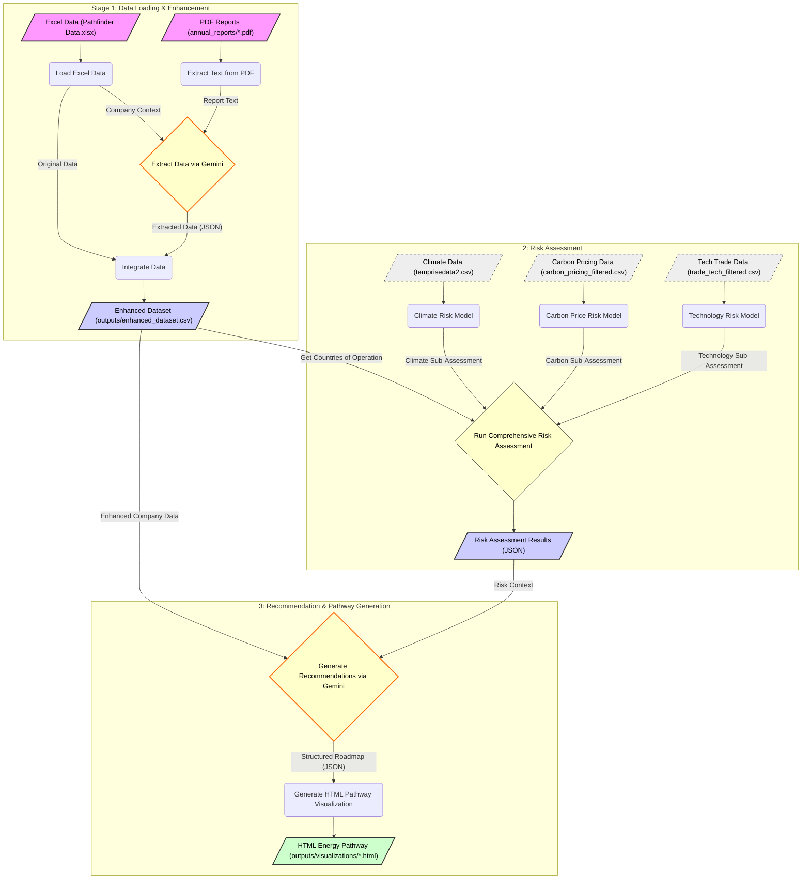

# Energy Transition Pathfinder

## Overview

The Energy Transition Pathfinder is a comprehensive tool designed to analyze corporate sustainability reports, assess transition risks, and generate data-driven, AI-powered energy transition roadmaps for companies, primarily in the energy sector. It combines backend data processing and risk analysis with a web-based frontend for user interaction, company management, dashboard visualization, and pathway exploration.

The system ingests company data from Excel sheets and PDF reports, uses Google's Gemini AI to extract key transition-related information, integrates this with quantitative risk assessments (Climate, Carbon Price, Technology), and ultimately generates tailored, interactive HTML roadmaps outlining strategic recommendations across different timeframes.

**Contributors:**

|  | Username | Name |
|:--:|:--------:|:-----|
|  | [advaitbd](https://github.com/advaitbd) | Advait Bharat Deshpande |
|  | [heypeiyee](https://github.com/heypeiyee) | Lee Pei Yee |
|  | [joannecheng037](https://github.com/joannecheng037) | Cheng Jia En Joanne |
|  | [cy12301](https://github.com/cy12301) | Wong Chin Yeow |


## Features

*   **PDF Data Extraction:** Extracts strategic priorities, financial commitments, risks, targets, and actions from PDF reports using AI.
*   **AI Integration (Google Gemini):** Leverages Gemini for intelligent data extraction and generation of structured, context-aware recommendations.
*   **Quantitative Risk Assessment:** Integrates custom models to assess company exposure to climate, carbon pricing, and technology transition risks based on operational geography.
*   **Data Integration & Enhancement:** Merges baseline data with AI-extracted insights and risk scores into an enhanced dataset (`enhanced_dataset.csv`).
*   **Recommendation Engine:** Generates detailed, time-bound energy transition strategies considering company specifics and risk profiles.
*   **Interactive HTML Visualization:** Creates user-friendly HTML roadmaps visualizing the recommended transition pathway, including risk factors and justifications.
*   **Web Backend (Flask API):** Provides endpoints to manage companies, upload reports, trigger processing, retrieve dashboard data, and generate/serve pathway visualizations.
*   **Web Frontend (React UI):** Offers a dashboard overview, company report management interface (upload/process status), and an interactive viewer for the generated HTML pathways.
*   **Caching:** Saves the enhanced dataset to optimize subsequent operations.

## Technology Stack

*   **Backend:** Python, Flask, Pandas, PyMuPDF (fitz), google-generativeai, Statsmodels
*   **Frontend:** React, TypeScript, Vite, Tailwind CSS, Chart.js, Axios
*   **AI Model:** Google Gemini
*   **Data Storage:** CSV (for enhanced dataset), File System (PDFs, HTML outputs)
*   **Environment Management:** python-dotenv, venv, npm

## Project Structure
```
.
├── analysis/ # Data integration, parsing, recommendation logic
├── config/ # Settings, API prompts
├── data/ # Input data loaders, savers, source Excel
├── frontend/ # React frontend application source code
│ ├── public/
│ ├── src/
│ ├── .env.development # Frontend environment config
│ └── package.json # Frontend dependencies
├── risk_eval/ # Risk evaluation models, data, and scripts
│ ├── Data/ # Datasets for risk models
│ └── result/ # Output from risk assessments
├── services/ # Modules for external services (Gemini, Visualization, Extraction)
├── utils/ # Utility functions (file handling, logging)
├── .env # Backend environment variables (API Keys) - KEEP PRIVATE
├── .env.sample # Sample backend environment file
├── .gitignore # Git ignore configuration
├── backend_api.py # Flask backend application
├── main.py # Original CLI script for pipeline execution (optional use)
├── requirements.txt # Python dependencies for backend
└── README.md
```

*(Note: PDF reports are typically placed in `annual_reports` or uploaded via the API to `annual_reports_uploads`)*

## Setup

**Prerequisites:**

*   Python 3.8+ and Pip
*   Node.js and npm (or yarn)
*   Git

**Steps:**

1.  **Clone the Repository:**
    ```bash
    git clone <repository_url>
    cd <repository_directory>
    ```

2.  **Backend Setup:**
    *   Create and activate a Python virtual environment:
        ```bash
        python3 -m venv venv
        source venv/bin/activate  # On Windows: venv\Scripts\activate
        ```
    *   Install Python dependencies:
        ```bash
        pip install -r requirements.txt
        ```
    *   Configure backend environment variables:
        *   Copy the sample environment file: `cp .env.sample .env`
        *   Edit `.env` and add your Google Gemini API Key:
            ```env
            GEMINI_API_KEY=YOUR_GOOGLE_API_KEY_HERE
            ```
        *   **Important:** Ensure `.env` is in your `.gitignore`.
    *   Prepare Input Data:
        *   Place the initial company data Excel file at `data/Pathfinder Data.xlsx` (or update `config/settings.py` if using a different path/name). Ensure it has a `Name` column.
        *   Ensure the PDF reports exist either in the directory specified by `DEFAULT_PDF_DIR` in `config/settings.py` (e.g., `annual_reports/`) OR be prepared to upload them via the frontend UI. PDF filenames (without extension) should ideally match the company `Name` in the Excel file for automatic association.

3.  **Frontend Setup:**
    *   Navigate to the frontend directory: `cd frontend`
    *   Install Node.js dependencies:
        ```bash
        npm install
        ```
    *   Configure frontend environment variables:
        *   Create a `.env.development` file in the `frontend` directory: `cp .env.development.sample .env.development` (if a sample exists) or create it manually.
        *   Edit `frontend/.env.development` and set the URL for your running backend API:
            ```env
            VITE_API_URL=http://localhost:5001
            ```
            (Adjust the port if your backend runs elsewhere).
    *   Navigate back to the project root: `cd ..`

## Running the Application

You need to run both the backend API and the frontend UI.

1.  **Start the Backend API:**
    *   Make sure your Python virtual environment is activated.
    *   From the project root directory, run:
        ```bash
        python backend_api.py
        ```
    *   The API will typically start on `http://localhost:5001` (or the port specified by the `PORT` environment variable). Watch the console output for the exact address and any errors (like missing API keys).

2.  **Start the Frontend UI:**
    *   Open a *new* terminal window/tab.
    *   Navigate to the frontend directory: `cd frontend`
    *   Run the development server:
        ```bash
        npm run dev
        ```
    *   The frontend will usually start on `http://localhost:5173` (Vite's default). Open this address in your web browser.

You should now be able to interact with the application through the web interface.

## Data Flow & Architecture



1.  **UI Interaction:** The user interacts with the React frontend.
2.  **API Requests:** The frontend sends requests to the Flask backend API for actions like fetching company status, uploading PDFs, triggering processing, or requesting pathways.
3.  **Backend Orchestration:**
    *   The API loads baseline data (`.xlsx`) and checks for existing PDFs/enhanced data (`.csv`).
    *   **Processing:** On request, it extracts text from the relevant PDF, calls the Gemini service for analysis/extraction, integrates the results with baseline data, and saves/updates the `enhanced_dataset.csv`.
    *   **Pathway Generation:** On request, it loads enhanced data for the company, runs the risk assessment (`risk_evaluator.py`), calls the Gemini service with data + risk context to generate recommendations (JSON), uses the visualization service to create an HTML file, and returns the path to the file.
4.  **Risk Evaluation:** The `risk_evaluator.py` module uses dedicated datasets to calculate climate, carbon price, and technology risks when requested by the recommendation process.
5.  **Static File Serving:** The Flask backend serves the generated HTML pathway files from the `outputs/visualizations` directory via a `/static/` route.
6.  **UI Display:** The frontend receives data (like dashboard info or pathway URLs) from the API and renders the appropriate components (tables, charts, iframes for pathways).

## Input / Output

*   **Inputs:**
    *   `data/Pathfinder Data.xlsx`: Initial company metadata.
    *   PDF Reports: Placed in `DEFAULT_PDF_DIR` or uploaded via API.
    *   Risk Datasets: Located in `risk_eval/Data/`.
    *   `.env` file: `GEMINI_API_KEY`.
    *   `frontend/.env.development`: `VITE_API_URL`.
*   **Outputs:**
    *   `outputs/enhanced_dataset.csv`: Integrated data including AI extractions.
    *   `outputs/visualizations/*.html`: Generated interactive pathway roadmaps.
    *   API JSON Responses: Data served to the frontend.
    *   Logs: Console output detailing the process.

## Configuration

*   **Backend API Key:** Set `GEMINI_API_KEY` in the `.env` file in the project root.
*   **Frontend API URL:** Set `VITE_API_URL` in `frontend/.env.development`.
*   **File Paths & Prompts:** Default paths (Excel, PDF dir, output dir), AI model name, and Gemini prompts are configured in `config/settings.py`.
*   **Upload Folder:** Configured in `backend_api.py` (defaults to `annual_reports_uploads`).

